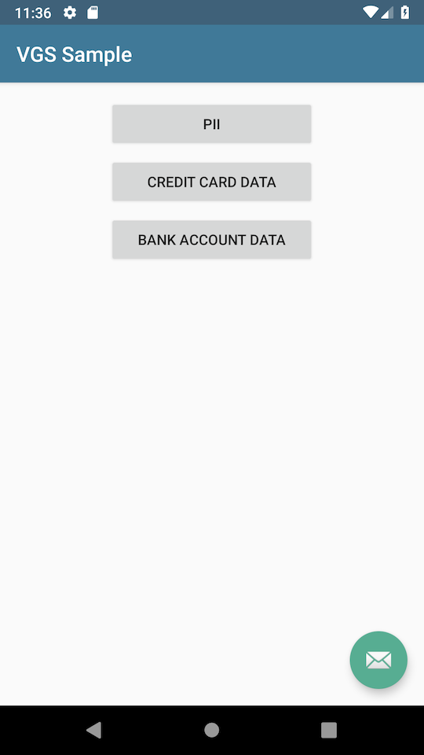

#vgs-ios-demo    

####Sample of using VGS on IOS with three common use cases.</i>

### Quick Start
//TODO: 

## Use Cases

The app demonstrates three different use cases of using VGS. Sample is configured to work with [Httpbin](https://httpbin.verygoodsecurity.io/) echo server which should replaced with your API in real case scenario.
Data that should be secured via VGS is getting replaced with tokens containing prefix `tok_` on proxy response.

1. Securing PII data:

2. Securing credit card data:

3. Securing bank account data:

## VGS Dashboard configuration

In order to configure the app to work with your vault apply the following route configuration via [VGS Dashboard](https://dashboard.verygoodsecurity.com/).

Upstream host configuration points to the [Httpbin](https://httpbin.verygoodsecurity.io/) echo server.

Most of the secured data should be saved using `PERSISTENT` storage and is configured using JsonPath.

Please note that CVV data should be configured to use `VOLATILE` storage due to PCI DSS requirements.

## Usage

To use the sample with your own vault change `vgs_proxy_url` in:    
[strings.xml](https://github.com/verygoodsecurity/vgs-android-sample/blob/master/app/src/main/res/values/strings.xml#L7) file to the URL of your inbound route.
This value can be found on dashboard in `Vault URLs` as `Inbound Route URL`:

## What is VGS?

**Quickstart** check out the [getting started guide](https://www.verygoodsecurity.com/docs/getting-started)    

Very Good Security (VGS) allows you to enhance your security standing while
maintaining the utility of your data internally and with third-parties. As an
added benefit, we accelerate your compliance certification process and help you
quickly obtain security-related compliances that stand between you and your
market opportunities.

To learn more, visit us at https://www.verygoodsecurity.com

## License

This project is licensed under the MIT license. See the [LICENSE](LICENSE) file
for details.
